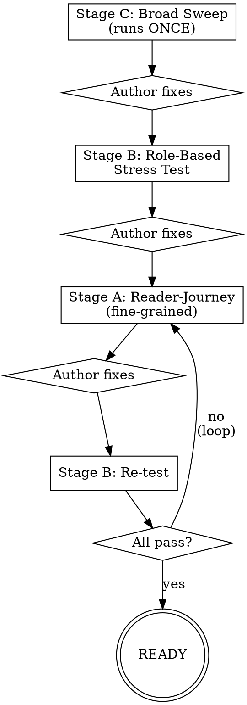
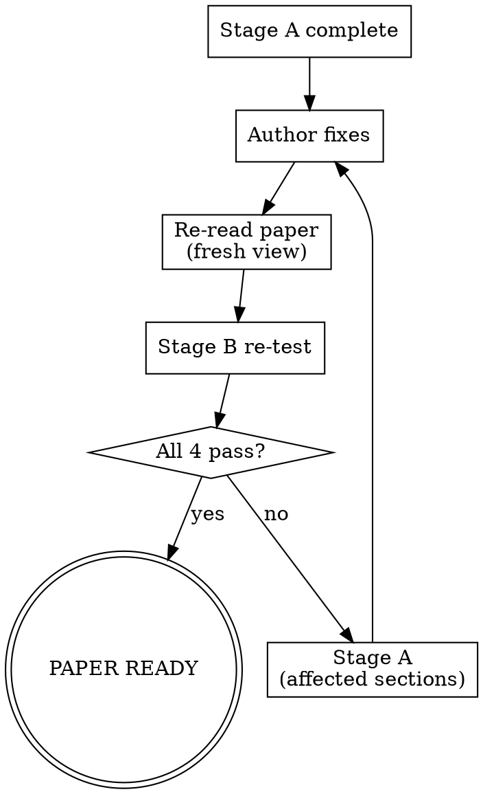

# Paper Human Review

## Overview

Multi-stage human-perception stress test for academic papers. Catches the "Soundness 4, Overall 2" gap -- papers where the science is solid but reviewers reject on presentation, clarity, or narrative coherence.

**Core principle:** If a paper passes LLM methodology review but fails human reviewers, the problem is perception, not science. This skill systematically finds and fixes perception failures.

**When to use:** Before submission, after methodology and experiments are complete. This is NOT a methodology review -- it assumes the science is sound and tests whether a human reviewer can follow, understand, and appreciate it.

**When NOT to use:** During early drafting, for methodology validation, or for papers still missing experiments.

## Invocation

The user provides a path to the paper (PDF, .tex, or .docx). Read the full paper before starting any pass.

Optional: the user may also provide actual reviewer feedback from a previous submission cycle. If provided, incorporate those specific concerns into Stage B3 (Hostile Reviewer) and Stage C3 (Adversarial Stress Test).

## Master Flow



**After each pass:** Present findings to the author and WAIT for their response before proceeding. The author may:
- Fix the issues (re-read the paper after fixes)
- Explain why an issue is not applicable (mark as "acknowledged")
- Break the loop at any time with "stop" or "good enough"

**State tracking:** Maintain a running issue tracker across passes:
- Each issue gets an ID: `C1-01`, `B3-02`, `A2-05`, etc.
- Status: OPEN / FIXED / ACKNOWLEDGED / WONTFIX
- Only OPEN issues count toward pass/fail

---

## Stage C: Broad Sweep (One-Time)

Run all three checklists sequentially. Present combined report to author before proceeding.

### C1 -- Presentation Quality

Read the paper and evaluate each item. For each issue, note the exact section/paragraph.

| # | Check | What to look for |
|---|-------|-------------------|
| 1 | **One-sentence contribution** | Can you state the paper's contribution in one sentence after reading only the abstract? If not, the abstract fails. |
| 2 | **Red thread** | State the paper's argument as a causal chain: "Problem X exists -> because Y -> we propose Z -> which achieves W." If you cannot construct this chain, the paper lacks narrative structure. This is CRITICAL. |
| 3 | **Acronym discipline** | Every acronym must be spelled out at first use. Check abstract (standalone context), intro (re-introduce), and body. Common failure: acronym in abstract without definition, defined later in Section 2. |
| 4 | **Figure self-containment** | Cover the paper text. Read only figure + caption. Can you understand what it shows? Check: axis labels readable, legend present, caption describes the takeaway not just "Results of experiment." |
| 5 | **Table self-containment** | Same test for tables. Check: column headers clear, units specified, bold/highlight for key values, caption explains what to look at. |
| 6 | **Worked example** | Is there at least ONE concrete example showing the method applied to real data with specific inputs and outputs? Not a toy example -- real data from the paper's domain. |
| 7 | **Results discussion** | For each results table/figure: is there a paragraph explaining WHAT the results mean? "Table 3 shows win rates" is reporting. "Qwen achieves the highest win rate (0.567), suggesting..." is discussion. |
| 8 | **Intro-conclusion alignment** | Does the conclusion deliver on every promise made in the intro? List intro claims and check each against the conclusion. |

### C2 -- Logical Consistency

| # | Check | What to look for |
|---|-------|-------------------|
| 1 | **Text-table number match** | Every number cited in running text must match its source table cell exactly. Check all. |
| 2 | **Cross-reference accuracy** | Every "as shown in Table/Figure X" -- verify X actually shows the claimed content. |
| 3 | **Citation relevance** | For each citation used to support a claim, verify the cited work actually supports that specific claim (not just the general topic). |
| 4 | **Contribution consistency** | Extract the contribution claim from: (a) abstract, (b) intro, (c) conclusion. Are they saying the same thing? Inconsistency signals confused narrative. |
| 5 | **Limitation honesty** | Do limitations contradict earlier claims? E.g., claiming "generalizes across languages" in the intro but admitting "only tested on 4 languages" in limitations. |
| 6 | **Evidence strength** | For every "we show/demonstrate/prove": does the evidence actually support that verb strength? "We show" requires statistical evidence. "We observe" is weaker. "We prove" requires formal proof. Flag overclaiming. |

### C3 -- Adversarial Stress Test

Answer each question concretely with specific references to the paper:

1. **Weakest claim:** What is the single weakest claim in the paper, and why?
2. **Missing comparison:** What is the most obvious baseline or prior work comparison that is absent?
3. **Abstract-only impression:** Read ONLY the abstract. Write one sentence describing your impression. Is it positive, negative, or confused?
4. **Overclaiming audit:** List every instance of "prove", "demonstrate", "show", "establish" and rate whether the evidence supports that verb strength.
5. **Strongest counterargument:** What is the single best "but what about..." objection a reviewer could raise?
6. **Inconvenient results:** Are there any results that hurt the paper's narrative? How are they handled? (Ignored = Critical. Discussed honestly = Good.)

### C Report Template

```
## Stage C Report

### C1 -- Presentation Quality
| ID | Severity | Location | Issue | Suggestion |
|----|----------|----------|-------|------------|

### C2 -- Logical Consistency
| ID | Severity | Location | Issue | Suggestion |
|----|----------|----------|-------|------------|

### C3 -- Adversarial Stress Test
[Narrative answers to each question]

### Summary
- Critical: N (must fix before proceeding)
- Important: N (should fix)
- Minor: N (nice to fix)

Proceed to Stage B? [Wait for author]
```

---

## Stage B: Role-Based Stress Test

Run all four personas. Each produces an independent report. Each persona reads the paper fresh -- do not let knowledge from one persona leak into another.

### B1 -- The Skimmer

**Reads ONLY:** title, abstract, all figures with captions, all tables with captions, section/subsection headers, conclusion. Does NOT read body text.

**Time budget:** Simulate 2 minutes of attention.

Answer:
1. In one sentence, what is this paper's contribution?
2. In one sentence, what is the main result?
3. Which figure/table is most informative? Which is least?
4. Based on this skim alone, rate interest (1-5): Would you read the full paper?
5. What questions do you have that the skim didn't answer?

**Pass criteria:** Skimmer correctly states contribution AND main result. Interest >= 3.

### B2 -- The Confused Reader

**Reads:** Everything, linearly, start to finish.

**Instructions:** Flag EVERY point of confusion, no matter how small. Be generous -- if a sentence could be misunderstood, flag it. You are a reviewer reading their 4th paper today with limited patience.

For each confusion point, report:
- Exact location (section, paragraph, sentence)
- What confused you
- What you expected to find instead
- Severity: **Blocker** (stops reading) / **Friction** (slows down) / **Ambiguity** (could go either way)

Also flag:
- Undefined terms or jargon
- Forward references ("as we show in Section 5" -- forces reader to trust you)
- Paragraph transitions that don't connect logically
- Sections that feel out of order

**Pass criteria:** Zero Blockers, <= 3 Friction points per section.

### B3 -- The Hostile Reviewer

**Reads:** Everything, with the goal of finding reasons to reject.

**Instructions:** You are a skeptical reviewer with 20 minutes. Generate specific, concrete objections -- not vague complaints.

If actual reviewer feedback was provided, incorporate those specific concerns and test whether they have been addressed.

Generate exactly 5 objections:

```
1. **[Category]:** "[Specific objection as a reviewer would write it]"
   - How damaging: High / Medium / Low
   - How to preempt: [What the paper could add/change to neutralize this]
```

Categories: Novelty, Experimental Design, Missing Comparison, Overclaiming, Presentation

Also answer:
- If forced to write Overall: 2 (Resubmit), what would be your main reason?
- If forced to write Overall: 4 (Accept), what would be your main reason?

**Pass criteria:** No High-damage objection that lacks a preemptive defense in the paper.

### B4 -- The Copy Editor

**Reads:** Everything, focusing on surface quality.

Check all of:
- Grammar and spelling errors (list each with location)
- Consistent formatting: "Table 1" vs "table 1", "Figure" vs "Fig."
- Reference format consistency (all same style?)
- Dangling references ("[?]" or broken \ref)
- Consistent tense (present for claims, past for experiments)
- Consistent number formatting (0.5 vs .5, commas in thousands)
- Widow/orphan lines, bad page breaks (if PDF)
- Overfull/underfull hboxes (if LaTeX)

**Pass criteria:** <= 5 total errors.

### B Report Template

```
## Stage B Report

### B1 -- The Skimmer
Contribution: [one sentence]
Main result: [one sentence]
Interest: [1-5]
Verdict: PASS / FAIL
[details]

### B2 -- The Confused Reader
| ID | Severity | Location | Confusion | Expected Instead |
|----|----------|----------|-----------|------------------|
Verdict: PASS / FAIL (Blockers: N, Friction: N/section)

### B3 -- The Hostile Reviewer
[5 numbered objections]
Resubmit reason: [one sentence]
Accept reason: [one sentence]
Verdict: PASS / FAIL

### B4 -- The Copy Editor
[list of errors]
Verdict: PASS / FAIL (N errors)

### Summary
Passes: N/4
Failures: [which personas failed and why]

Proceed to Stage A? [Wait for author]
```

---

## Stage A: Reader-Journey (Fine-Grained)

Run all five passes sequentially. Each builds on the previous.

### A1 -- First Impression (30-Second Skim)

Simulate a reviewer opening the PDF for the first time. Spend 30 seconds looking at:
- Title, author block, abstract
- Overall page layout and density
- Figure/table count and visual quality
- Length vs page limit

Report:
1. **First impression score (1-5):** How professional/compelling does this look?
2. **First thing noticed (positive):** What catches the eye in a good way?
3. **First thing noticed (negative):** What catches the eye in a bad way?
4. **Density assessment:** Wall of text / well-balanced / too sparse?
5. **Would you approach this paper with positive or negative expectations?**

### A2 -- Narrative Thread (Linear Read)

Read the entire paper intro-to-conclusion. Maintain a thread tracker:

For each section transition, note:
- Does this section follow logically from the previous one?
- Is there a clear topic sentence establishing what this section will do?
- At the END of this section, can you state how it advances the paper's argument?

After reading the full paper:
1. **State the red thread in one sentence.** Format: "Because [problem], we [approach], which [result], demonstrating [implication]." If you CANNOT construct this sentence, report as CRITICAL.
2. **Mark every argument break** -- points where logical flow breaks and you had to re-orient.
3. **Identify the sag point** -- the section where energy/momentum drops most.

### A3 -- Concrete Grounding

For each of these, answer YES or NO with evidence:

| Claim Type | Has Concrete Example? | Location | Quality (1-5) |
|------------|----------------------|----------|----------------|
| Main method description | | | |
| Each sub-component | | | |
| Each evaluation metric | | | |
| Key finding #1 | | | |
| Key finding #2 | | | |
| Key finding #3 | | | |

For items scoring <= 2, provide a specific suggestion:
- What input data to use
- What the expected output looks like
- Where in the paper to place it

Also flag **math islands**: equations without (a) intuitive explanation before, (b) concrete instantiation after, or (c) variable definitions nearby.

### A4 -- Internal Consistency Audit

Systematically verify:

**Numbers in text vs tables:**

| Text Location | Claimed Value | Source | Actual Value | Match? |
|---------------|--------------|--------|--------------|--------|

**Cross-references:**

| Text Location | Claim | Reference | Actually Shows | Correct? |
|---------------|-------|-----------|----------------|----------|

**Abstract claims vs results evidence:**

| Abstract Claim | Supporting Evidence | Strength |
|----------------|-------------------|----------|

### A5 -- Reviewer Pushback Simulation

Generate two mock reviews:

**Mock Review 1: Overall 2 (Resubmit)**
Write a realistic 200-word review justifying Resubmit. Use actual weaknesses found in previous passes. Include: Summary (2 sentences), Strengths (2 bullets), Weaknesses (3-4 bullets), Questions (2-3), Overall assessment.

**Mock Review 2: Overall 4 (Accept)**
Write a realistic 200-word review justifying Accept. Use actual strengths. Same structure.

**Gap Analysis:**
1. Which weaknesses from Review 1 could be fixed before submission?
2. Which strengths from Review 2 are undersold in the current paper?
3. What single change would most increase the probability of Review 2 over Review 1?

### A Report Template

```
## Stage A Report

### A1 -- First Impression
Score: [1-5]
[details]

### A2 -- Narrative Thread
Red thread: "[sentence]"
Argument breaks: [list with locations]
Sag point: [section]

### A3 -- Concrete Grounding
[claims table]
Math islands: [list]

### A4 -- Internal Consistency
[verification tables]

### A5 -- Mock Reviews
[two reviews + gap analysis]

### Summary
Critical findings: [list]
Key recommendation: [single most impactful change]

Re-run Stage B to verify fixes? [Wait for author]
```

---

## Convergence Loop

After Stage A fixes, re-run Stage B:



**Re-run rules:**
- Stage C: NEVER re-run (structural issues fixed in first pass)
- Stage B: Re-run ALL 4 personas each time (fresh perspective)
- Stage A: Re-run ONLY passes with open issues from previous iteration
- Maximum 3 iterations of the A->B loop (diminishing returns after)

**Author can break at any time.** Report current open issue count and let them decide.

## Pass/Fail Criteria

### Overall Readiness

| Level | Criteria | Recommendation |
|-------|----------|----------------|
| **Green** | 0 Critical, <= 2 Important, B1 interest >= 4 | Submit with confidence |
| **Yellow** | 0 Critical, <= 5 Important, B1 interest >= 3 | Submit but expect presentation feedback |
| **Red** | Any Critical OR > 5 Important OR B1 interest < 3 | Revise before submitting |

### Per-Pass Thresholds

| Pass | Pass if... |
|------|------------|
| C1 Presentation | Red thread exists, worked example present, figures self-contained |
| C2 Consistency | All numbers match, no overclaiming |
| C3 Adversarial | No unanswerable objection |
| B1 Skimmer | States contribution + result correctly, interest >= 3 |
| B2 Confused | 0 Blockers, <= 3 Friction per section |
| B3 Hostile | No High-damage undefended objection |
| B4 Copy Editor | <= 5 errors |
| A2 Narrative | Red thread constructible in one sentence |
| A3 Grounding | Every key claim has concrete example (quality >= 3) |
| A4 Consistency | 100% number matches |

## Quick Reference

| Stage | What | When | Passes |
|-------|------|------|--------|
| **C** | Broad structural sweep | Once, first | C1 Presentation, C2 Consistency, C3 Adversarial |
| **B** | Persona stress test | After C, then after each A | B1 Skimmer, B2 Confused, B3 Hostile, B4 Copy Editor |
| **A** | Fine-grained perception | After first B, then targeted | A1 Impression, A2 Narrative, A3 Grounding, A4 Consistency, A5 Mock Reviews |
